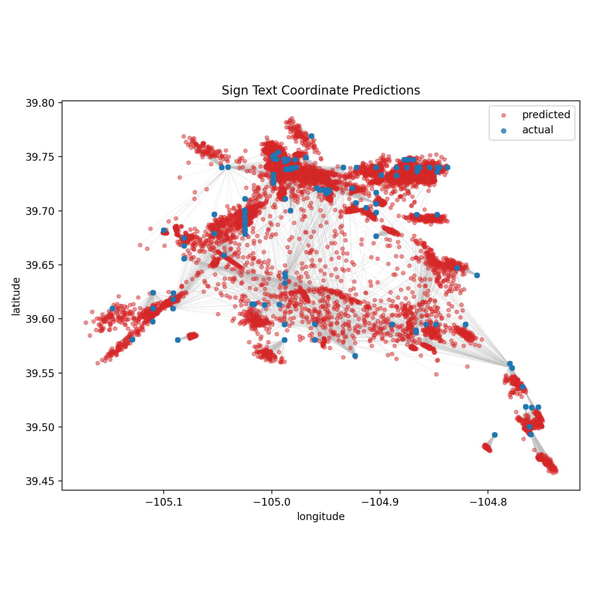
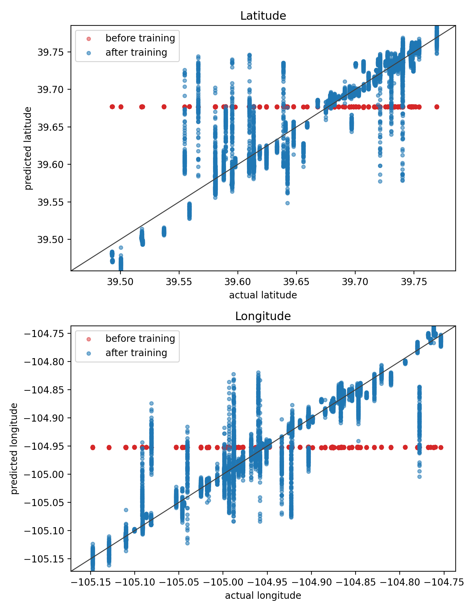

# Sign Coordinate Regressor

This project fine-tunes a sentence-transformer model to predict a latitude and
longitude pair from text observed on signs at an intersection.

The raw dataset is expected at `training_data_raw.csv`. It may include the
pandas-exported index column; the preprocessing script only uses:

- `intersection`
- `text_on_sign_exact`
- `latitude`
- `longitude`

## Workflow

Prepare bootstrapped training rows:

```bash
source .venv/bin/activate
python prepare_training_data.py --seed 1992 --bag-size 5 --samples-per-intersection 50
```

This writes `training.csv` with rows shaped like:

```text
intersection,sample_id,text,latitude,longitude,unique_sign_count,raw_sign_count
```

Each row is a deterministic bootstrap sample of sign texts from one
intersection, joined into a single text field. This trains on "some signs seen
at this coordinate" instead of one sign or every sign at that coordinate.

Train the model:

```bash
python train.py
```

Evaluate and write predictions:

```bash
python eval.py
```

This writes `predictions.csv` and a map-style diagnostic plot:



It also writes a coordinate calibration plot:



Or run the full pipeline:

```bash
make
```

## Command-line options and defaults

All of the project scripts accept command-line flags, and each one has a default value that is used when you do not pass an override. The defaults are intentionally documented here so it is clear which behavior can be customized.

### `prepare_training_data.py`

Creates the bootstrapped training CSV from the raw sign data.

| Argument | Default | Description |
| --- | --- | --- |
| `-i`, `--input-file` | `training_data_raw.csv` | Raw pandas-exported CSV to read. |
| `-o`, `--output-file` | `training.csv` | Prepared training dataset written by the script. |
| `--seed` | `1992` | Random seed used for deterministic bootstrapping. |
| `--bag-size` | `8` | Number of sign texts to combine into each training row. |
| `--samples-per-intersection` | `100` | Number of bootstrap bags generated for each intersection. |
| `--separator` | `" | "` | String used to join sampled sign texts into one training string. |

Example:

```bash
python prepare_training_data.py \
  --input-file training_data_raw.csv \
  --output-file training.csv \
  --seed 1992 \
  --bag-size 5 \
  --samples-per-intersection 50 \
  --separator " | "
```

### `train.py`

Trains the sentence-transformer encoder and coordinate regression head.

| Argument | Default | Description |
| --- | --- | --- |
| `--data-file` | `training.csv` | Training dataset path. |
| `--output-path` | `output` | Directory where model artifacts are written. |
| `--model-name` | `sentence-transformers/all-MiniLM-L6-v2` | Base sentence-transformer model to fine-tune. |
| `--device` | `None` | Optional explicit device such as `cpu`, `cuda`, or `mps`; if omitted, CUDA is used when available and otherwise CPU is used. |
| `--seed` | `1992` | Random seed for reproducibility. |
| `--epochs` | `10` | Number of training epochs. |
| `--batch-size` | `64` | Batch size for training. |
| `--num-workers` | `2` | DataLoader worker processes. |
| `--save-every-epochs` | `5` | Save the best checkpoint every N epochs (and at final epoch). |
| `--learning-rate` | `1e-4` | Learning rate for the encoder. |
| `--head-learning-rate` | `5e-2` | Learning rate for the coordinate head. |
| `--weight-decay` | `0.001` | Weight decay for optimization. |
| `--test-size` | `0.2` | Fraction of rows used for the validation/test split. |
| `--hidden-dim` | `256` | Hidden dimension in the coordinate regressor. |
| `--dropout` | `0.1` | Dropout used inside the regression head. |
| `--freeze-encoder` | `False` | If set, only the coordinate head is trained and the encoder stays fixed. |
| `--freeze-transformer-layers` | `0` | Freeze the first N transformer layers in the encoder. |
| `--freeze-attention` | `False` | Freeze self-attention parameters while leaving other encoder parameters trainable. |

Example:

```bash
python train.py \
  --data-file training.csv \
  --output-path output \
  --model-name sentence-transformers/all-MiniLM-L6-v2 \
  --device cuda \
  --epochs 20 \
  --batch-size 32 \
  --learning-rate 2e-5 \
  --head-learning-rate 1e-2 \
  --hidden-dim 512 \
  --dropout 0.15
```

### `eval.py`

Loads a trained model and writes predictions and diagnostics.

| Argument | Default | Description |
| --- | --- | --- |
| `--data-file` | `training.csv` | Dataset to score. |
| `--model-path` | `output` | Directory containing the trained model artifacts. |
| `--output-file` | `predictions.csv` | CSV path for predicted coordinates and error metrics. |
| `--plot-file` | `plots/prediction_map.png` | Path to the map-style prediction error plot. |
| `--scatter-plot-file` | `plots/predicted_vs_actual.png` | Path to the predicted-vs-actual scatter plot. |
| `--device` | `None` | Optional explicit device override; otherwise CUDA is used when available, else CPU. |
| `--batch-size` | `64` | Batch size used for inference. |
| `--seed` | `1992` | Must match the training seed for the same test split. |
| `--test-size` | `0.2` | Must match the training split size. |

Example:

```bash
python eval.py \
  --data-file training.csv \
  --model-path output \
  --output-file predictions.csv \
  --plot-file plots/prediction_map.png \
  --scatter-plot-file plots/predicted_vs_actual.png \
  --batch-size 128
```

### `generate_data.py`

Generates city-distance data used for computing distances between cities.

| Argument | Default | Description |
| --- | --- | --- |
| `-c`, `--country` | `US` | Country code to use when searching cities. |
| `-w`, `--workers` | `1` | Number of worker threads used for computation. |
| `-s`, `--chunk-size` | `1000` | Batch size for chunking distance calculations. |
| `-o`, `--output-file` | `distances.csv` | Output CSV path for generated distances. |
| `--shuffle` | `False` | If set, shuffle the combinations before processing. |

Example:

```bash
python generate_data.py \
  --country US \
  --workers 4 \
  --chunk-size 2000 \
  --output-file distances.csv \
  --shuffle
```

## Outputs

- `training.csv`: prepared bootstrapped dataset.
- `output/`: saved sentence-transformer encoder, coordinate head, and coordinate
  normalization metadata.
- `predictions.csv`: evaluation rows with predicted coordinates and `error_km`.
- `plots/prediction_map.png`: actual vs predicted coordinates with line segments
  showing the prediction error.
- `plots/predicted_vs_actual.png`: predicted vs actual latitude and longitude
  scatter plots.
